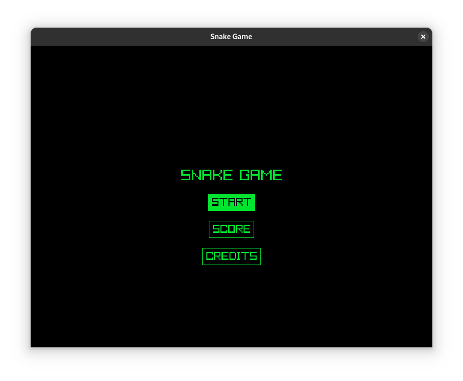
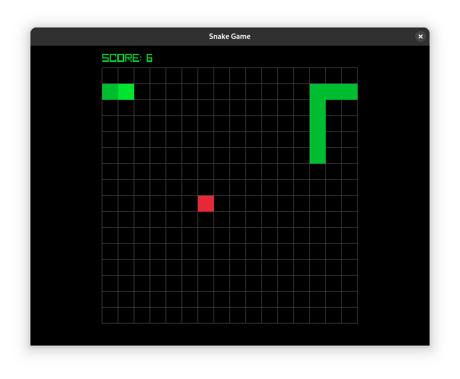
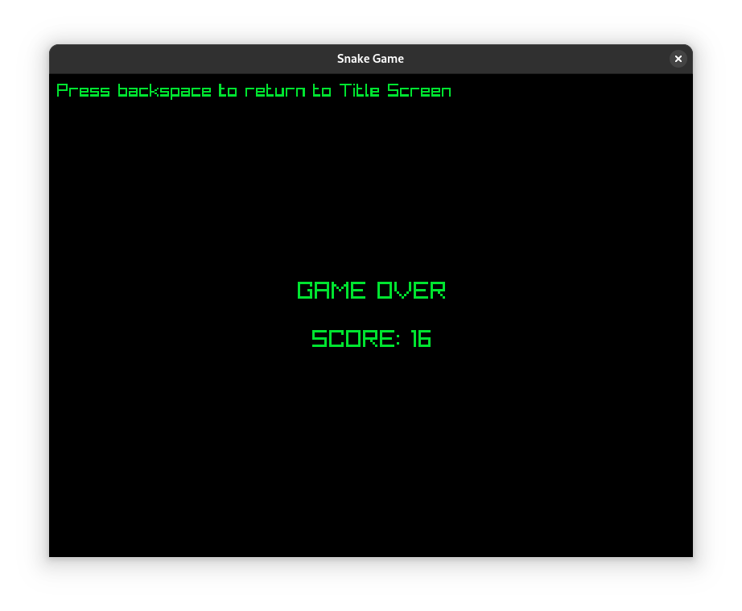
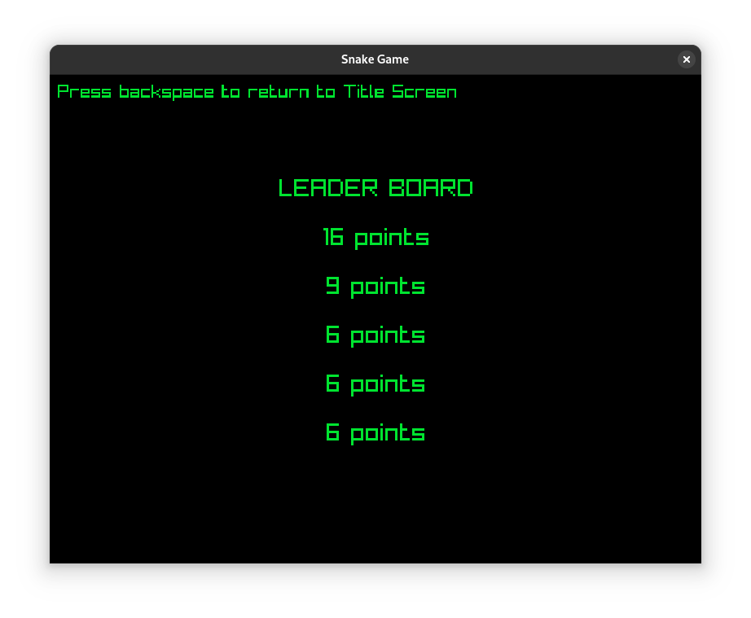

# Snake Game

<div align="center">
  
  
</div>
<div align="center">
  
  
</div>

## Description
This is a simple Snake Game built with C and Raylib.

## Requirements
- Raylib
- GCC

## How to run
```bash
git clone https://github.com/GabrielCASilva/snake-game-raylib.git
```
Inside the project folder:
```bash
make cc-open
```
## How to play
Use the arrow keys on your keyboard to move the snake and collect apples.
Each apple you eat increases your score — try to beat the high score!
